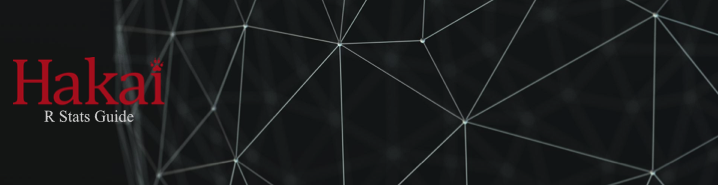

--- 
title: "Hakai Institute R Stats Guide"
author: "Brett Johnson"
description: "This is the Hakai Institutes R Guide"
date: "Latest update: `r Sys.Date()`"
cover-image: "images/analyst_red.png"
output: bookdown::gitbook
site: bookdown::bookdown_site
documentclass: book
biblio-style: apalike
link-citations: yes
github-repo: HakaiInstitute/hakai_guide_to_r
---
---
```{r serve the book}
#Once you build this book, you can serve the book to auto update in the viewer window by removing the hashtag in the code line below

#bookdown::serve_book(dir = ".", output_dir = "_book", preview = TRUE, in_session = TRUE)

```
# Preface {-}

___

```{r, echo = FALSE}

```

___
One of Hakai's core themes that cross-cuts each [research axis](https://www.hakai.org/research) is 'Big-Data and Modelling'. Our ability to gain insight from our long-term ecological data sets is limited only by our capacity to integrate, and digest data. To that end, this guide was developed to serve as a foundation from which to build the internal technical capacity — using a coherent and systematic approach — to turn data into insight, understanding, and ultimately knowledge about the ecosystems we study.

Through this guide you can learn data management skills, R programming basics, project workflow and organization, reproducible research techniques, and collaborative analysis development in an open-science context. These skills are learned through R and R-Studio, granted the skills and principles are relevant to many programming languages or analysis softwares available.

This guide was originally intended to be useful to graduate students, Hakai staff, and research collaborators working with the Juvenile Salmon Survival Program. However, given the synergistic nature of many of Hakai's research programs, and the apparent appetite from research technicians for a guide to R, the guide has been extended for consideration by other Hakai programs more generally. 

